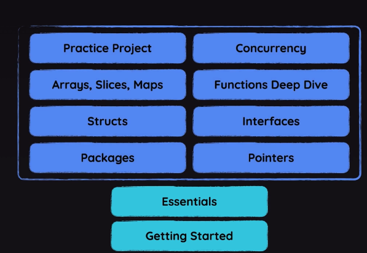

# Chapter 1

https://github.com/mschwarzmueller/go-complete-guide-resources



# Chapter 2

## the important of the name "main"

- Commonly a module is simply a Project
- Since not everyone has go installed, define a module, main package(tells go where application starts) and a main function in main package(tells which code to execute when application starts)
- one module consists of multiple Packages
- folder are mostly consider as package
- fmt has no main folder and main function
- const ,var declaration can be outside in the main function [function cannot be runned outside]

```
go mod init exxample.com/first-app (define a module)
go build (compile application)
./first-app (execute application)

go run . (compile and run)
```

## Go types and null values

- int (default null values: 0)
- float64 (default null values: 0.0)
- string (default null values: "")
- bool (default null values: false)

## fmt

- fmt.Println("test pointer",investmentAmount)
- fmt.Printf("Future Value: %v\nFuture Real Value: %v\n", futureValue, futureRealValue)
- formattedFV := fmt.Sprintf("Future Value: %.1f\n", futureValue)

## function

```

func getUserInput(infoText string) float64 {
	var userInput float64
	fmt.Print(infoText)
	fmt.Scan(&userInput)
	return userInput
}


func calculateFutureValues(investmentAmount, expectedReturnRate, years float64) (fv float64, rfv float64) {
	fv = investmentAmount * math.Pow(1+expectedReturnRate/100, years)
	rfv = fv / math.Pow(1+inflationRate/100, years)
	return fv, rfv
	//return
}
```

## Control Structure

```
	if choice == 1 {
		fmt.Println("Your balance is", accountBalance)
	}else if choice == 2 {
		fmt.Print("Your deposit: ")
		var depositAmount float64
		fmt.Scan(&depositAmount)
		accountBalance += depositAmount // accountBalance = accountBalance + depositAmount
		fmt.Println("Balance updated! New amount:", accountBalance)
	} else if choice == 3 {
		fmt.Print("Withdrawal amount: ")
		var withdrawalAmount float64
		fmt.Scan(&withdrawalAmount)
		accountBalance -= withdrawalAmount
		fmt.Println("Balance updated! New amount:", accountBalance)
	} else {
		fmt.Println("Goodbye!")
	}

	for i := 0; i < 200; i++ {
	}

	// go has no while loop
	for someCondition {

	}

	// the break statement in switch has different meaning
	switch choice {
	case 1:
		fmt.Println("Your balance is", accountBalance)
	case 2:
		fmt.Println("Your balance is", accountBalance)
	case 3:
		fmt.Println("Your balance is", accountBalance)
	default:
		fmt.Println("Goodbye!")
		fmt.Println("Thanks for choosing our bank")
		return
		// break
	}

```

## Handling errors

- err != nil (means no error)
- golang does not exist try except
- panic()

# Chapter 3

## Splitting Code in the Same Package

- functions and variable are shared under same package

## Exporting and Importing Identifiers

- Only uppercase named can be exported

## Install third libraries package

- go get github.com/Pallinder/go-randomdata
- go mod tidy [update go.mod and create detailed]

# Chapter 4

## Understanding pointers

- variables that store value addresses instead of values
- advantage of pointers: 1. Avoid unnecessary value copies 2. Directly Mutate Values
- 1. use a pointer to avoid copy (Default: GO creates a copy when passing values to function and use garbage collector to delete)
- 2. can lead less code
- In a variable declaration, the \* before a type declares a pointer type.
- When used in an expression, the \* operator dereferences a pointer.
- pointer null value is nil
- overall if without using return, we use pointer hence the argument is the pointer and no return

# Chapter 5

## Structs and custom type

- Grouping data and methods into collection
- if creating a custom type use type e.g. type user struct {}
- struct is a blue print, we use it to create an instance
- we can also create a function that outputs a instance of struct
- adding receiver argument to the function, the instance of the blueprint will have the method
- struct can modify its own struct value
- struct only check when compiled not run-time
- constructor function is a function of creating a instance of struct
- constructor function can also be used for validation
- values of the struct can be expose if uppercase
- normally values are not exposed while methods are
- struct embedding: all values and methods will be inherited
- the embedded Struct with anonymous embedding field, its instance can call the method without referencing embedding field
- When calling a method with a pointer receiver, Go allows you to use either a value or a pointer, and Go will handle taking the address automatically if needed.

## Custom type

- we can also assign method to our custom type

## struct tags

- some libraries, use struct tags(metadata) to mapping such as validation and db fields

# Chapter 6

## Interface

- Polymorphism: different instance to treat as a instance of a common superset. It also means methods can work in different way depending the instance
- Go implements polymorphism through interfaces
- Interface is a contract that a certain value has a certain method
- There exist 4 pillars in OOP: Encapsulation (hide data), Inheritance, Polymorphism(superset), Abstraction(interface not golang interface)
- Abstraction in Interface means encapsulate the instance while abstraction in struct means not encapsulate details
- Interface can be embedded just like struct
- if struct method using a pointer receiver, the interface type must also be a pointer
- the following statement does not meet in interface: When calling a method with a pointer receiver, Go allows you to use either a value or a pointer, and Go will handle taking the address automatically if needed.
- interface{} is equivalent to any
- value.(type) can only be used in switch, use e.g. value.(int)

## Generics

- adding placeholder for types

# Chapter 7

## Arrays

- arrays are fixed size and a value type
- prices := [4]float64{10.99, 9.99, 45.99, 20.0}

## Slices

- slices is dynamic size and a reference type to an underlying array
- slice can be resized and will create a new underlying array if the capacity is exceeded
- append has no limit of values e.g. append(prices,5,6,7,8,9), append(prices,discoutPrices...)
- if [], it is a slice, otherwise it is a array

## Maps

- maps and structs are both key value structure
- structs are set in stone (cannot be changed)

## Make

- nill is declared but not assigned in the memory for reference type
- reallocate memory for map and slice
- since resize a slice recreate an array, we can pre allocate some space using make (tell go need a bigger array)
- make([]string, 2, 5) // create an array with two empty slots and the array has capacity of 5

## Type Alias

- type floatMap map[string]float64

## For Loop

- for key, value := range courseRatings {}
- for index, value := range userNames {}

# Chapter 8

## using functions as value

- not only as parameters but also as return value

## anonymous functions

- function without name
- is not a function type, it is a value type

## closure

- create factory function (create function outputs and use outer scope parameters to lock in for future use)

## recursion

## variadic functions

- if numbers... in a function parameter then it will create an slice in the background
- if numbers... a value when calling a function then it will split slices

# Chap10

## concurrency & Goroutines

- making progress on them without blocking each other.
- the code after <- will not be executed after it is done
- goroutine does not support return value
- if use one channel with multiple goroutines, remember to close the last one e.g. close(doneChan)
- multiple goroutines suggest to use list to collect all channels

## defer

- defer file.Close()

# Overview

## most used packages

- strings: strings.TrimSuffix, strings.ReplaceAll, strings.ToLower [instance methods]
- os: os.ReadFile,os.WriteFile, os.OpenFile
- bufio: bufio.NewReader
- encoding/json: json.Marshal,json.Unmarshal
- math: math.Pow
- fmt: fmt.Scanln, fmt.Println,fmt.Sprint
- errors: errors.New [struct instance]
- time: time.now(), time.Time [struct]
- strconv:strconv.Atoi, strconv.ParseFloat
- go-randomdata: randomdata.PhoneNumber

## go types

- value type: basics,structs,arrays
- reference type: Slices, maps, channels, pointers, functions

## create:

```
- [3]string{"Sports", "Cooking", "Reading"} //array
- []Product{{"first-product","A First Product",12.99,},{"second-product","A Second Product",129.99,},} // slice
- map[string]string{"Google": "https://google.com","Amazon Web Services": "https://aws.com",}
```

```
type TestStruct struct {
Field1 int
Field2 string
}
type TestMap map[string]string

type EmptyStruct struct{}
type nameStruct struct {
firstName string
lastName string
}

type emptyMap map[string]string
type nonEmptyMap map[string]string

// nil is for reference type , we need to use make first

// struct is a value type
var s TestStruct
fmt.Println("TestStruct", s)
s2 := TestStruct{}
fmt.Println("TestStruct{}", s2)
fmt.Println("TestStruct{}", TestStruct{})

// map is a reference type
var m TestMap
fmt.Println("TestMap", m)
m2 := TestMap{}
fmt.Println("TestMap{}", m2)
fmt.Println("TestMap{}", TestMap{})
m3 := make(TestMap)
fmt.Println("make(TestMap)", m3)

// named
// error
//fmt.Println("EmptyStruct", EmptyStruct)
fmt.Println("EmptyStruct{}", EmptyStruct{})
fmt.Println("nameStruct{}", nameStruct{})
fmt.Println("nameStruct{}", nameStruct{
firstName: "hello",
lastName: "world",
})
// error
// fmt.Println("emptyMap", emptyMap)
fmt.Println("emptyMap{}", emptyMap{})
fmt.Println("nonEmptyMap{}", nonEmptyMap{})
fmt.Println("nonEmptyMap{}", nonEmptyMap{
"firstName": "hello",
"lastName": "world",
})

// anonymous
fmt.Println("struct{}{}", struct{}{})
fmt.Println("struct{}{}", struct {
firstName string
lastName string
}{
firstName: "hello",
lastName: "world",
})
fmt.Println("map[string]int{}", map[string]string{})
fmt.Println(map[string]string{
"Google": "https://google.com",
"Amazon Web Services": "https://aws.com",
})

// make

makeMap := make(map[string]string)
fmt.Println("makeMap", makeMap)
makeMap["firstName"] = "Chen"
fmt.Println("makeMap", makeMap)

makeSlice := make([]int, 5)
fmt.Println("makeSlice", makeSlice)

```
